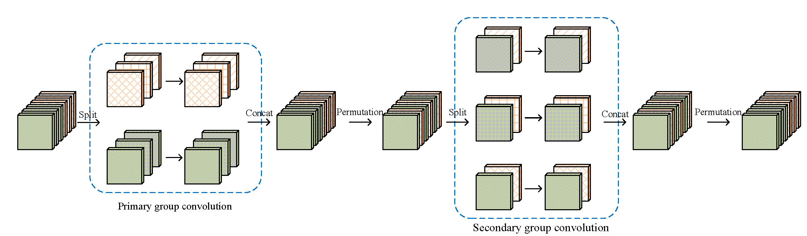
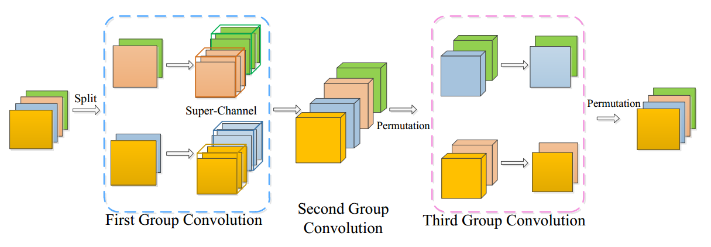

# IGCV3
**IGCV3:Interleaved Low-Rank Group Convolutions for Efficient Deep Neural Networks.**  
IGCV3 code and pretrained model based on https://github.com/liangfu/mxnet-mobilenet-v2.

## Prior Works

### Interleaved Group Convolutions([IGCV1](https://arxiv.org/pdf/1707.02725.pdf))
Interleaved Group Convolution uses a pair of two successive interleaved group convolutions: primary group convolution and secondary group convolution. The two group convolutions are complementary.


>  Illustrating the interleaved group convolution, with L = 2 primary partitions and M = 3 secondary partitions. The convolution for each primary partition in primary group convolution is spatial. The convolution for each secondary partition in secondary group convolution is point-wise (1 × 1).

### Interleaved Structured Sparse Convolution([IGCV2](https://arxiv.org/pdf/1804.06202.pdf))
IGCV2 extends IGCV1 by decomposing the convolution matrix in to more structured sparse matrices, which uses a depth-wise convoultion(3 × 3) to replace the primary group convoution in IGC and uses a series of point-wise group convolution(1 × 1).


## Interleaved Low-Rank Group Convolutions(IGCV3)
We proposed Interleaved Low-Rank Group Convolutions, named IGCV3, extend IGCV2 by using low-rank group convolutions to replace group convoutions in IGCV2. It consists of a channel-wis spatial convolution, a low-rank group convolution with G_1 groups that reduces the width and a low-rank group convolution with G_2 groups which expands the widths back.


>  Illustrating the interleaved branches in IGCV3 block. The first group convolution is a group $1\times1$ convolution with G_1=2 groups. The second is a channel-wise spatial convolution. The third is a group 1 × 1 convolution with $G_2=2$ groups.

## Results
### CIFAR Experiments
We compare our IGCV3 network with other Mobile Networks on CIFAR dataset which illustrated our model' advantages on small dataset.
#### Comparison with Other Mobile Networks
Classification accuracy comparisons of MobileNetV2 and IGCV3 on CIFAR datasets. "Network s×" means reducing the number of parameter in "Network 1.0×" by s times.
<table > 
<tr> <th width=100></th><th>#Params (M)</th> <th>CIFAR-10</th> <th> CIFAR100 </th> </tr> 
<tr> <th> </th>MobileNetV2（our impl.） <th> 2.3</th><th>94.56</th> <th>77.09</th></tr>
<tr> <th> </th>IGCV3-D 0.5× <th> 1.2</th><th>94.73</th> <th>77.29</th></tr>
<tr> <th> </th>IGCV3-D 0.7×<th> 1.7</th><th>94.92</th> <th>77.83</th></tr>
<tr> <th> </th>IGCV3-D 1.0×<th> 2.4</th><th>94.96</th> <th>77.95</th></tr>
</table>

#### Comparison with IGCV2
<table > 
<tr> <th width=100></th><th>#Params (M)</th> <th>CIFAR-10</th> <th> CIFAR100 </th> </tr> 
<tr> <th> </th>IGCV2<th> 2.4</th><th>94.76</th> <th>77.45</th></tr>
<tr> <th> </th>IGCV3-D<th> 2.4</th><th>94.96</th> <th>77.95</th></tr>
</table>

### ImageNet Experiments
Comparison with MobileNetV2 on ImageNet.
#### Before Retrain
<table > 
<tr> <th width=100></th><th>#Params (M)</th> <th>Top-1</th> <th>Top-5</th> </tr> 
<tr> <th> </th>MobileNetV2<th> 3.4</th><th>70.0</th> <th>89.0</th></tr>
<tr> <th> </th>IGCV3-D<th> 3.5</th><th>70.6</th> <th>89.7</th></tr>
</table>

#### After Retrain
<table > 
<tr> <th width=100></th><th>#Params (M)</th> <th>Top-1</th> <th>Top-5</th> </tr> 
<tr> <th> </th>MobileNetV2<th> 3.4</th><th>71.4</th> <th>90.1</th></tr>
<tr> <th> </th>IGCV3-D<th> 3.5</th><th>72.2</th> <th>90.5</th></tr>
</table>

## Requirements
- Install [MXNet](https://mxnet.incubator.apache.org/install/index.html)

## How to Train
Current code supports training IGCNV3 on ImageNet, such as `IGCV3`s, `MobileNet-V2`. All the networks are contained in the `symbol` folder.


For example, running the following command can train the `IGCV3` network on ImageNet.

```shell
python train_imagenet.py --network=IGCV3 --multiplier=1.0 --gpus=0,1,2,3,4,5,6,7 --batch-size=96 --data-dir=<dataset location>
```
multiplier is means how many times wider than the original IGCV3 network whose width is the same as MobileNet-V2(https://arxiv.org/pdf/1801.04381).

## Citation

Please cite our papers in your publications if it helps your research:

```
@article{WangWZZ16,
  author    = {Jingdong Wang and
               Zhen Wei and
               Ting Zhang and
               Wenjun Zeng},
  title     = {Deeply-Fused Nets},
  journal   = {CoRR},
  volume    = {abs/1605.07716},
  year      = {2016},
  url       = {http://arxiv.org/abs/1605.07716}
}
```

```
@article{ZhaoWLTZ16,
  author    = {Liming Zhao and
               Jingdong Wang and
               Xi Li and
               Zhuowen Tu and
               Wenjun Zeng},
  title     = {On the Connection of Deep Fusion to Ensembling},
  journal   = {CoRR},
  volume    = {abs/1611.07718},
  year      = {2016},
  url       = {http://arxiv.org/abs/1611.07718}
}
```

```
@article{DBLP:journals/corr/ZhangQ0W17,
  author    = {Ting Zhang and
               Guo{-}Jun Qi and
               Bin Xiao and
               Jingdong Wang},
  title     = {Interleaved Group Convolutions for Deep Neural Networks},
  journal   = {CoRR},
  volume    = {abs/1707.02725},
  year      = {2017},
  url       = {http://arxiv.org/abs/1707.02725}
}
```

```
@article{DBLP:journals/corr/abs-1804-06202,
  author    = {Guotian Xie and
               Jingdong Wang and
               Ting Zhang and
               Jianhuang Lai and
               Richang Hong and
               Guo{-}Jun Qi},
  title     = {{IGCV2:} Interleaved Structured Sparse Convolutional Neural Networks},
  journal   = {CoRR},
  volume    = {abs/1804.06202},
  year      = {2018},
  url       = {http://arxiv.org/abs/1804.06202},
  archivePrefix = {arXiv},
  eprint    = {1804.06202},
  timestamp = {Wed, 02 May 2018 15:55:01 +0200},
  biburl    = {https://dblp.org/rec/bib/journals/corr/abs-1804-06202},
  bibsource = {dblp computer science bibliography, https://dblp.org}
}
```
